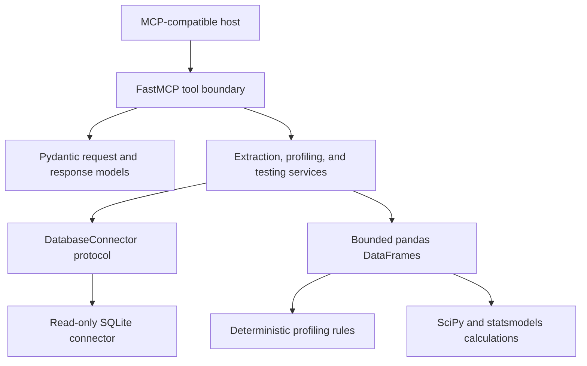

# Statistical Testing MCP Server

A read-only, database-agnostic Model Context Protocol (MCP) server for bounded table discovery,
deterministic profiling, and maintained-library statistical testing.

The hackathon MVP uses SQLite, pandas, SciPy, and statsmodels. It exposes structured tools that let
an MCP-compatible host discover a table, inspect suitable columns, run an approved test, and explain
the returned evidence without inventing or recalculating statistical values.

## MVP status

The MVP is complete and exposes exactly three tools:

| Tool | Question answered |
| --- | --- |
| `list_tables` | Which tables and views are available through the configured SQLite database? |
| `profile_table` | What bounded, deterministic metadata and suggested statistical roles describe a table? |
| `run_test` | What is the result of either Welch's independent t-test or a two-proportion z-test? |

The server does not execute user-supplied SQL, write to the database, call an LLM, infer causality,
or implement statistical procedures beyond the two approved tests.

The authoritative product scope is [PROJECT_SPEC.md](PROJECT_SPEC.md). Repository contribution and
safety rules are in [AGENTS.md](AGENTS.md).

## Installation

Prerequisites:

- Python 3.11 or newer
- Git
- An MCP-compatible client for the conversational demo

Clone and install:

```bash
git clone https://github.com/gdavos007/stat-agent-mcp-spec.git
cd stat-agent-mcp-spec
python3 -m venv .venv
source .venv/bin/activate
python -m pip install --upgrade pip
python -m pip install -e .
```

Generate the deterministic demo database. The generator refuses to overwrite an existing file:

```bash
mkdir -p .demo
python scripts/create_demo_db.py .demo/demo.sqlite3
```

## Local stdio usage

Configure the server in the current shell:

```bash
export STAT_MCP_CONNECTION_NAME=demo_sqlite
export STAT_MCP_SQLITE_PATH="$PWD/.demo/demo.sqlite3"
export STAT_MCP_DEFAULT_ROW_LIMIT=1000
export STAT_MCP_HARD_ROW_LIMIT=10000
```

Start the stdio server:

```bash
stat-agent-mcp
```

The process waits for MCP messages on stdin. Logs belong on stderr; stdout is reserved for MCP
protocol traffic. Use `Ctrl-C` to stop a manually launched server.

## Local HTTP usage

Set the database variables above, generate a high-entropy bearer token, and start the HTTP entry
point. `PORT` defaults to `8000` outside Railway.

```bash
python -c "import secrets; print(secrets.token_urlsafe(32))"
export STAT_MCP_HTTP_BEARER_TOKEN="<paste-the-generated-value>"
export PORT=8000
stat-agent-mcp-http
```

The public readiness endpoint is `GET http://127.0.0.1:8000/health`. MCP requests use
`http://127.0.0.1:8000/mcp` and require `Authorization: Bearer <token>`.

## Railway deployment

The included [railway.toml](railway.toml) explicitly installs the package during Railway's build,
then starts the Streamable HTTP module without relying on a generated console script being on
`PATH`:

```text
python -m pip install .
python -m stat_agent_mcp.http_server
```

Configure these Railway variables:

| Variable | Recommended value | Notes |
| --- | --- | --- |
| `STAT_MCP_CONNECTION_NAME` | `railway_demo` | Safe public label returned to MCP clients. |
| `STAT_MCP_SQLITE_PATH` | `/tmp/stat-agent-mcp/demo.sqlite3` | Ephemeral Option A demo database location. |
| `PORT` | Railway-provided | The application reads this directly; do not interpolate it in the start command. |
| `STAT_MCP_HTTP_BEARER_TOKEN` | Generate at least 32 high-entropy characters | Store as a sealed/private Railway variable. Never commit or log it. |

On HTTP startup, an absent SQLite database is generated deterministically in a temporary file beside
the configured target, validated, and atomically published. Parent directories are created as
needed. A valid existing database is reused. Railway's `/tmp` storage is ephemeral, so the demo
database is regenerated on every fresh deployment. This option is intended for demonstrations and
evaluation rather than persistent user data.

### Authentication

The Streamable HTTP MCP endpoint is `/mcp` and requires this header:

```text
Authorization: Bearer <STAT_MCP_HTTP_BEARER_TOKEN>
```

Generate a token locally with a cryptographically secure generator, for example:

```bash
python -c "import secrets; print(secrets.token_urlsafe(32))"
```

Copy only the generated value into Railway's sealed/private variable configuration. Do not put it in
`railway.toml`, `.env.example`, source code, client logs, or a committed `.env` file. Missing,
malformed, and incorrect authorization all receive the same `401` response. The shared token is
controlled-demo authentication, not OAuth/OIDC, per-user authorization, or a production identity
system. The endpoint must not be considered publicly safe without authentication. Railway checks
the unauthenticated `/health` route, which returns only `{"status":"ok"}`.

## Example MCP client connections

MCP clients use different configuration locations, but a typical stdio entry looks like this:

```json
{
  "mcpServers": {
    "statistical-testing": {
      "command": "/absolute/path/to/stat-agent-mcp-spec/.venv/bin/stat-agent-mcp",
      "env": {
        "STAT_MCP_CONNECTION_NAME": "demo_sqlite",
        "STAT_MCP_SQLITE_PATH": "/absolute/path/to/stat-agent-mcp-spec/.demo/demo.sqlite3",
        "STAT_MCP_DEFAULT_ROW_LIMIT": "1000",
        "STAT_MCP_HARD_ROW_LIMIT": "10000"
      }
    }
  }
}
```

Use absolute paths because the client may launch the server from another working directory. Do not
put credentials or private connection details in the safe `STAT_MCP_CONNECTION_NAME` label.

The server does not automatically load `.env` files. [.env.example](.env.example) documents the
available variables; provide them through the launching shell or the MCP client's environment
configuration.

For Streamable HTTP, the official Python client accepts an authenticated `httpx.AsyncClient`:

```python
import httpx
from mcp import ClientSession
from mcp.client.streamable_http import streamable_http_client

headers = {"Authorization": "Bearer <paste-the-generated-value>"}

async def connect() -> None:
    async with httpx.AsyncClient(headers=headers) as http_client:
        async with streamable_http_client(
            "https://your-service.up.railway.app/mcp",
            http_client=http_client,
        ) as streams:
            async with ClientSession(streams[0], streams[1]) as session:
                await session.initialize()
```

## Demo flow

The seeded `experiment_results` table contains 40 deterministic records:

- `record_id`: integer primary key
- `variant`: independent groups `A` and `B`
- `account_balance`: continuous numeric outcome
- `converted`: binary `0`/`1` outcome
- two null balances and two null conversion outcomes for exclusion reporting

Suggested conversational flow:

1. Ask: “Which tables are available?”
2. Ask: “Profile `experiment_results` and identify useful outcome and grouping columns.”
3. Ask: “Did variants A and B have different average account balances?”
4. Ask: “Did conversion proportions differ between variants A and B? Treat `1` as success.”

The host should call `list_tables`, then `profile_table`, then `run_test`. It may explain the
structured output, but it should not recalculate the statistic, p-value, or effect size.

Expected audit facts for the full seeded table:

- The Welch test compares 19 non-null balances in each group and reports two null exclusions.
- The proportion test observes 6 successes among 19 rows in A and 10 among 19 rows in B.
- The proportion risk difference is calculated as `A proportion - B proportion`.
- Some normal-approximation counts are between five and nine, so the proportion result includes a
  borderline-approximation warning.

Exact floating-point values should come from the tool result and its maintained statistical
libraries rather than being copied from this README.

## Tool contracts

All tools return typed structured output. Successful and expected-error results are distinguished by
the `status` discriminator.

### `list_tables`

Inputs: none.

Successful output includes:

- safe connection name
- database engine
- deterministic table/view names and types

It never returns the SQLite path or a complete connection URL.

### `profile_table`

Inputs:

- `table`: conservative table identifier
- `max_rows`: optional positive requested row cap

The profile includes row/null counts, cardinality, pandas and database types, bounded examples,
numeric summaries, categorical frequencies, and one deterministic suggested role:

- `continuous_outcome`
- `binary_outcome`
- `grouping_variable`
- `identifier`
- `datetime`
- `other`

Role suggestions are rule-based and advisory. They use primary-key metadata, type, cardinality,
uniqueness, and null information; they do not use an LLM. Examples are limited and suppressed for
identifier or obvious secret-like column names, but this is not comprehensive PII detection.

### `run_test`

Common inputs:

- `test_id`: `welch_t_test` or `two_proportion_z_test`
- `table`
- `outcome_column`
- `grouping_column`
- `group_values`: exactly two explicit values in meaningful order
- `alpha`: strictly between zero and one
- `max_rows`: optional positive requested row cap
- `success_value`: required only for `two_proportion_z_test`

Common output includes hypotheses, statistic, p-value, significance flag (`p_value < alpha`), group
summaries, effect size, assumptions, warnings, exclusions, and bounded-extraction metadata.

#### Welch's independent two-sample t-test

- Uses `scipy.stats.ttest_ind` with `equal_var=False` and a two-sided alternative.
- Requires a numeric continuous outcome and independent groups.
- Requires at least two usable observations per group.
- Rejects non-null, non-numeric, and non-finite outcome values rather than silently discarding them.
- Returns bias-corrected Hedges' g from statsmodels.
- Statistic and effect direction follow `group_1 - group_2`.

Do not use it for paired/repeated observations or categorical outcomes.

#### Two-proportion z-test

- Uses `statsmodels.stats.proportion.proportions_ztest` with a two-sided alternative.
- Validates exactly two non-null outcome values within the selected groups.
- Requires the caller to identify the success value explicitly; it is never inferred.
- Requires at least five observed successes and five observed failures in each group.
- Warns when any approximation count is between five and nine.
- Returns risk difference as `group_1 proportion - group_2 proportion`.

Do not use it when observations are dependent or sparse counts violate the documented approximation
rule.

## Extraction and safety behavior

The production server is read-only:

- SQLite is opened with URI `mode=ro` and `PRAGMA query_only`.
- No connector or MCP tool exposes arbitrary SQL execution.
- Only requested columns are selected.
- Identifiers must pass a conservative lexical policy and resolve through database metadata.
- Every DataFrame extraction is bounded by the configured hard limit.
- The connector fetches one sentinel row beyond the effective limit solely to detect truncation; the
  sentinel is not included in `rows_examined` or analysis.
- Stable ordering uses declared primary-key columns or an unshadowed SQLite rowid alias.
- Relations without a deterministic ordering strategy return a structured error.
- Missing and malformed identifiers, incompatible types, invalid groups, sparse samples, and
  unsupported tests return safe structured errors.
- Configuration paths and connection details are not returned through tools or expected errors.

Requested limits are clamped to the hard limit:

```text
effective_limit = min(requested_limit or default_limit, hard_limit)
```

The MVP uses deterministic first-N limiting, not random sampling. When truncation occurs, results
include an explicit warning because ordered first-N data may be systematically biased and may not
represent the full table.

Null accounting uses mutually exclusive row categories. A row with a null outcome or grouping value
is counted as a null exclusion before group selection. Rows belonging to other valid groups are
counted as unselected-group exclusions.

## Configuration reference

| Variable | Required | Default | Purpose |
| --- | --- | --- | --- |
| `STAT_MCP_CONNECTION_NAME` | No | `demo_sqlite` | Safe public label returned to MCP clients. |
| `STAT_MCP_SQLITE_PATH` | Yes | none | Internal SQLite path; HTTP startup creates demo data when it is absent. |
| `STAT_MCP_DEFAULT_ROW_LIMIT` | No | `1000` | Limit used when a tool request omits `max_rows`. |
| `STAT_MCP_HARD_ROW_LIMIT` | No | `10000` | Absolute maximum rows retained by an extraction. |
| `STAT_MCP_HTTP_BEARER_TOKEN` | HTTP only | none | Secret shared bearer token; at least 32 visible ASCII characters. |
| `PORT` | HTTP only | `8000` | TCP port used by the Streamable HTTP entry point. Railway supplies this value. |

Both limits must be positive, and the default cannot exceed the hard limit. The stdio entry point
still requires an existing database and never bootstraps one. The HTTP entry point validates and
reuses an existing SQLite database or atomically generates the deterministic demo database when the
configured path is absent.

The stdio entry point does not read or require `STAT_MCP_HTTP_BEARER_TOKEN`. The HTTP entry point
fails before serving if the token is missing, blank, too short, contains whitespace or control
characters, or is not visible ASCII.

The connector request contract reserves an optional timeout value for future engines. SQLite query
timeout enforcement is limited in this MVP and is not exposed as a public configuration setting.

## Architecture



Responsibilities are deliberately separated:

- `server.py` composes configuration, connector, services, and tool registration.
- `config.py` loads and validates environment-backed settings.
- `connectors/` owns all production database-driver access, metadata inspection, identifier-safe SQL,
  and bounded extraction.
- `services/` coordinates connector-independent profiling and statistical workflows.
- `statistics/` accepts pandas or ordinary Python values and imports no database or MCP objects.
- `models/` defines structured public contracts.
- `tools/` translates domain results and safe errors at the MCP boundary.
- `health.py` registers the public constant-time readiness route without database access.
- `connectors/demo_sqlite.py` owns deterministic SQLite demo generation and atomic HTTP bootstrap.
- `scripts/create_demo_db.py` is a thin local CLI around the installed generator.
- `tests/` contains unit and seeded SQLite integration coverage.

A future database engine should require a connector implementation, registration/configuration,
optional dependencies, tests, and documentation. It should not require changes to profiling or
statistical calculations.

## Development and verification

Install development dependencies:

```bash
python -m pip install -e ".[dev]"
```

Run the required checks:

```bash
python -m pytest
python -m ruff check .
python -m ruff format --check .
python -m mypy src tests scripts
```

The suite includes:

- SciPy reference comparisons for Welch's test
- statsmodels reference comparisons for the proportion test and Hedges' g
- effect-size direction tests
- invalid statistical input and sparse approximation tests
- null, non-numeric, and binary validation tests
- unsafe/missing identifier tests
- hard-limit, selected-column, deterministic-order, and truncation tests
- seeded SQLite integration tests for all three MCP tools
- structured error/session-boundary and secret-redaction tests

Do not commit generated databases, virtual environments, caches, `.env`, or credentials. Do not
commit or push changes unless the repository owner explicitly requests it.

## Limitations and deliberately postponed work

- SQLite is the only implemented connector.
- Deterministic first-N limiting is bounded and reproducible but is not representative sampling.
- Query timeout enforcement is limited for SQLite.
- Suggested profile roles are heuristics, not semantic guarantees.
- Example suppression is not full PII discovery or anonymization.
- No confidence intervals are returned in the MVP.
- No one-sided alternatives, paired tests, regression, ANOVA, chi-square, Mann-Whitney U, or other
  procedures are implemented.
- No natural-language-to-SQL, arbitrary SQL, server-side LLM, causal inference, UI, OAuth/OIDC,
  per-user authorization, or persistent deployment storage is included.
- The Railway deployment is intended for demonstrations and evaluation. PostgreSQL remains a future
  milestone for durable production data.

Statistical significance is evidence against a null hypothesis under stated assumptions. It does not
establish causality, practical importance, or a business decision.

## Codex contribution record

This repository was developed as a sequence of reviewed vertical slices with Codex assistance.

| Area | Contribution record |
| --- | --- |
| Architecture | Codex proposed the connector boundary, synchronous SQLite MVP, deterministic first-N extraction, structured errors, profiling rules, and statistical module separation in response to [ARCHITECTURE_PROMPT.md](ARCHITECTURE_PROMPT.md). |
| Generated/edited code | Codex substantially generated and edited the Python package scaffold, safe configuration, connector, extraction, profiling, statistical services, MCP adapters, demo generator, package metadata, and authenticated Railway HTTP deployment. |
| Generated tests | Codex generated the unit and seeded SQLite integration tests, including maintained-library references, effect sizes, limits, exclusions, invalid inputs, MCP contracts, secret safety, and installed stdio/HTTP smoke coverage. |
| Human decisions | The human developer supplied and approved the product specification and repository rules, selected the milestone sequence, reviewed each milestone handoff, and explicitly authorized commits and pushes. |
| Important prompts | The initial architecture task is preserved in [ARCHITECTURE_PROMPT.md](ARCHITECTURE_PROMPT.md); implementation followed approved Milestones 1–6. Git history preserves the resulting development checkpoints. |

No credentials, authentication tokens, private Codex transcripts, or fabricated session identifiers
are stored in this record.
